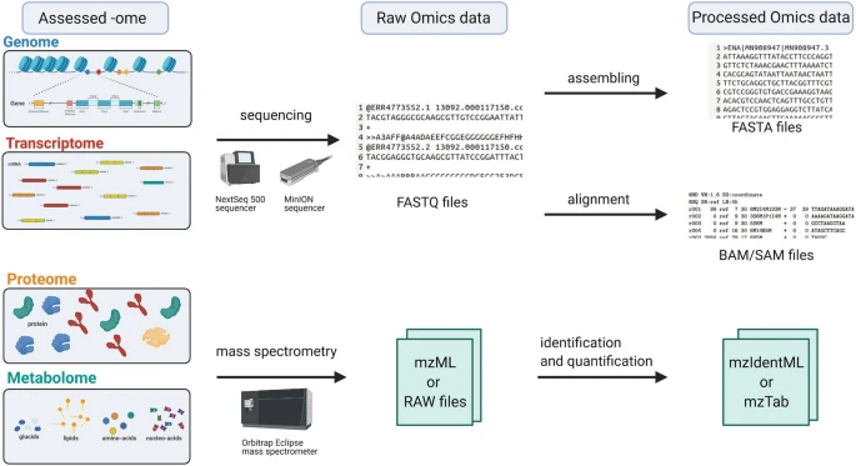

# Working with Omics Data: An Interdisciplinary Challenge at the Crossroads of Biology and Computer Science (Poinsignon 2023)

Source: OneNote — Week1 (Poinsignon 2023)

**Last updated:** 2025-10-30

---

## Summary

This document summarizes core concepts from "Working with Omics Data" (Poinsignon, 2023). It covers the major omics types (genome, transcriptome, proteome, metabolome), how omics data are generated (microarrays, high-throughput sequencing, mass spectrometry), file formats and repositories, and typical downstream uses (annotation, differential expression, multi-omics integration).

---

## Introduction: 4 main types of molecular components

- Genome: DNA molecules.

- Transcriptome: RNA molecules, including:
  - Messenger RNA (mRNA), ribosomal RNA (rRNA), transfer RNA (tRNA), non-coding RNA (ncRNA).
  - Focus is usually on mRNA as the messenger between the genome and the proteome.
  - Transcriptomes are more dynamic than genomes; transcriptome datasets list mRNA sequences present at a given time.

- Proteome: Proteins (macromolecules made from one or several polymerized amino acids).
  - Common protein functions:
    - Backbone of cell structure
    - Detect or transmit external/internal chemical signals
    - Enzymatic activity
    - Regulation and expression of genetic information
  - Function often depends on 3-D conformation.
  - Proteomes are dynamic; proteome datasets list proteins present at a given time.

- Metabolome: Small molecules (metabolites) that act as substrates/products in biochemical reactions.
  - Typical metabolite classes: nucleotides, amino acids, lipids, ATP, and more.
  - Metabolomics datasets list metabolites present in a cell at a given time.

All omics data typically arise from high-throughput experimental strategies that allow observation of many items rapidly and often simultaneously (e.g., Illumina NGS, nanopore sequencing, mass spectrometry) [1].

---

## What are Omics Data?

### Sequencing (genomics & transcriptomics)

- Sequencing is used to gather genomics and transcriptomics data.

- This image illustrates raw → processed omics data (place the provided schematic here):

  

- FASTQ: the file format for raw reads produced by sequencers. Key points:
  - Each read has an associated Phred quality score (commonly 0–62) which encodes the probability of an incorrect base call [2].
  - Reads are typically short sequences (commonly 50–200 nt for short-read platforms).
  - FASTQ contains sequence lines and quality score lines for each read [3].

- FASTA: a simple sequence format (often used for assembled sequences or reference sequences).

### Example FASTQ excerpt (illustrative):

```text
@SEQ_ID
GATCGGAAGAGCACACGTCTGAACTCCAGTCAC
+
IIIIIIIIIIIIIIIIIIIIIIIIIIIIIIIII
```

### Mass spectrometry (proteomics & metabolomics)

- Mass spectrometers and vendors initially used proprietary binary file formats. To enable data exchange, HUPO-PSI and community standards such as mzML were developed [4].

- Thermo Fisher RAW files are a common vendor format containing retention time, intensity, and m/z values.

- Software such as MaxQuant ingests these data to identify and quantify proteins [5].

---

## Repositories and data sharing

- Raw and processed omics data are often shared publicly for reproducibility and reuse.
  - Genomics: NCBI GenBank / Genome databases (sequence + annotation).
  - Transcriptomics: Gene Expression Omnibus (GEO), Sequence Read Archive (SRA).
  - Proteomics: PRIDE (mass-spec proteomics repository).
  - Metabolomics: MetaboLights (archive and knowledge base).
  - Platforms like ELIXIR provide infrastructure and indexing for omics resources.

---

## How to generate Omics Data

### Microarrays

- Microarrays are glass slides printed with thousands of DNA probes at defined positions.
- mRNA is reverse-transcribed to cDNA, labeled with a fluorescent molecule, and hybridized to slide probes.
- Fluorescence intensity at each spot indicates relative expression of the corresponding gene.
- Microarrays can measure expression of thousands of genes simultaneously but have largely been superseded by sequencing for many applications.

### High-throughput sequencing (HTS / NGS)

-- Illumina (sequencing by synthesis) is the predominant short-read NGS technology:
  - Low per-base error rate, high throughput, but limited read length (short fragments).
  - Enables massive parallel sequencing [1].

-- Nanopore sequencing (e.g., MinION):
  - Detects electrical changes as a molecule passes through a nanopore.
  - Produces very long reads (advantages for assembly and structural variant calling) but typically with higher error rates [11].

- HTS outputs FASTQ files. Typical downstream workflows:
  1. Align reads to a reference genome (mapping) or assemble into contigs (assembly).
  2. Count reads aligned to features (e.g., genes) to produce expression matrices (for transcriptomics).
  3. Perform parameter optimization and quality control to ensure trustworthy results.

### Mass spectrometry (proteomics & metabolomics)

- Bottom-up proteomics workflow (classical):
  1. Proteins are enzymatically digested into peptides.
  2. Peptides are separated by liquid chromatography (LC column).
  3. Peptides are ionized and analyzed in the mass spectrometer; migration through the spectrometer separates ions by m/z.
  4. An abundance is estimated per fraction.

- Data acquisition strategies:
  - Data-dependent acquisition (DDA): fragments are isolated for MS/MS when intensity exceeds a threshold; yields MS/MS spectra for selected precursors.
  - Data-independent acquisition (DIA): acquires spectra for all ions in a window; requires spectral libraries and deconvolution to identify peptides.

### Single-cell strategies

- Bulk omics measure averages across many cells. Single-cell omics resolves heterogeneity by profiling individual cells.
- Early single-cell methods involved manual isolation; modern approaches allow parallel sequencing of thousands of cells.

---

## Analysis steps (brief)

- Sequencing data:
  - Quality control (e.g., read quality, adapter trimming)
  - Alignment or assembly
  - Quantification (counts per gene/transcript)
  - Differential expression analysis (DEA) to find genes whose expression changes across conditions

- Mass-spec data:
  - Convert vendor files to open formats (e.g., mzML)
  - Identification (matching spectra to peptide sequences)
  - Quantification (label-free or labeled methods)

---

## Applications of Omics Data

- Describe biological systems via identification, quantification, and functional connections between molecular components.
- Typical outputs: sequence, structure, location, functional annotation, abundance.

- Genomics:
  - Annotate genomic features (genes, tRNA, rRNA, pseudogenes, transposons, SNPs, repeats, telomeres, centromeres).
  - Comparative genomics enables knowledge transfer across species and insights into evolution and speciation.

- Transcriptomics:
  - Differential expression analysis (DEA) identifies genes responding to conditions (mutations, treatments, stimuli).
  - Improves genome annotation by verifying gene models and identifying previously undetected transcripts.

- Proteomics:
  - Detects post-translational modifications and protein relocalization.
  - Complements transcriptomic data by revealing regulation beyond mRNA levels.

- Multi-omics:
  - Integrating multiple omics layers is powerful but resource intensive (time, cost, manpower) and methodologically challenging due to heterogeneous data types.

---

## Conclusions and additional omics

- Additional omics modalities:
  - Epigenomics: chemical modifications to DNA (e.g., methylation) that influence gene regulation.
  - Lipidomics: profiling lipid subpopulations within the metabolome.

- As biological big data grows, there is an increased need for robust analysis pipelines, standardized file formats, and reproducible repositories.

---


## References / Links

Source: Poinsignon, 2023 — OneNote lecture notes (user-provided)

Numbered references (in order of appearance):

[1] Metzker, M.L. (2010). Sequencing technologies — the next generation. Nature Reviews Genetics. (NGS overview; Illumina)

[2] Ewing, B. & Green, P. (1998). Base-calling of automated sequencer traces using phred. Genome Research. (Phred quality scores)

[3] Cock, P.J.A., Fields, C.J., Goto, N., Heuer, M.L. & Rice, P.M. (2010). The FASTQ file format for sequences with quality scores. Nucleic Acids Research. (FASTQ format overview)

[4] Martens, L., et al. (2011). mzML — a community standard for mass spectrometry data. (HUPO-PSI mzML format)

[5] Cox, J. & Mann, M. (2008). MaxQuant enables high peptide identification rates and proteome-wide protein quantification. Nature Biotechnology. (MaxQuant)

[6] Edgar, R., Domrachev, M., & Lash, A.E. (2002). Gene Expression Omnibus: NCBI gene expression and hybridization array data repository. Nucleic Acids Research.

[7] Leinonen, R., Sugawara, H., & Shumway, M. (2011). The Sequence Read Archive. Nucleic Acids Research.

[8] Vizcaíno, J.A., et al. (2016). PRIDE database update. Nucleic Acids Research.

[9] Haug, K., et al. (2013). MetaboLights — an open-access database for metabolomics studies.

[10] ELIXIR Consortium (2014). ELIXIR: a distributed infrastructure for life-science information.

[11] Oxford Nanopore Technologies. MinION nanopore sequencing documentation (platform documentation).

File formats and repositories referenced in-text: FASTQ, FASTA, mzML, NCBI GenBank/Genome, GEO, SRA, PRIDE, MetaboLights, ELIXIR.

---

## Notes / Next steps for me

- I inserted image links referencing `./images/figure1.png` and `./images/figure2.png`. Please copy the attached images into `GA5/images/` and name them exactly `figure1.png` and `figure2.png` (see `GA5/images/README.md` for instructions).
- If you'd like the images embedded as SVG or optimized PNGs, I can convert them if you upload higher-resolution versions.


---

*Generated from the OneNote notes you pasted. If you want more formatting (callouts, footnotes, or a reference list with DOIs), tell me and I will add them.*